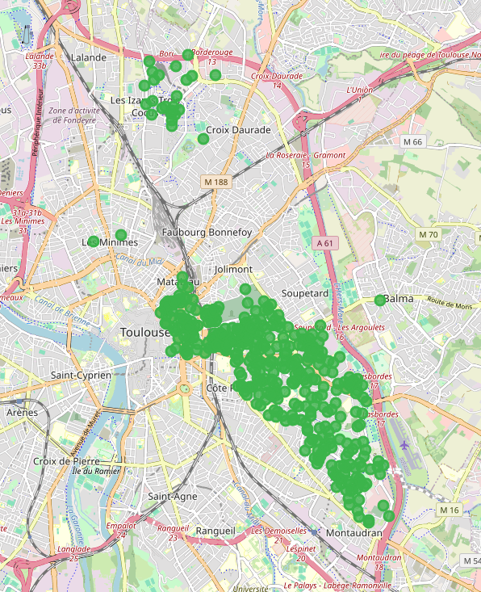

# Vibe Coding S1 2026

Partant d'un PDF donnant "la carte scolaire des Lycée Toulousains" (quelle rue correspond à quel lycée), produire une visualisation.
[Résultat](carte_rues_lycees_toulouse.html)
*
